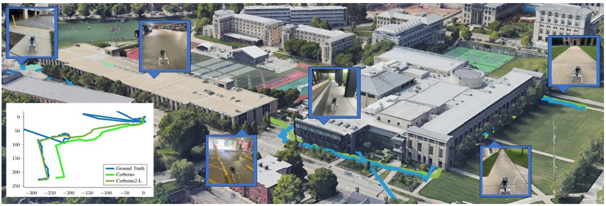
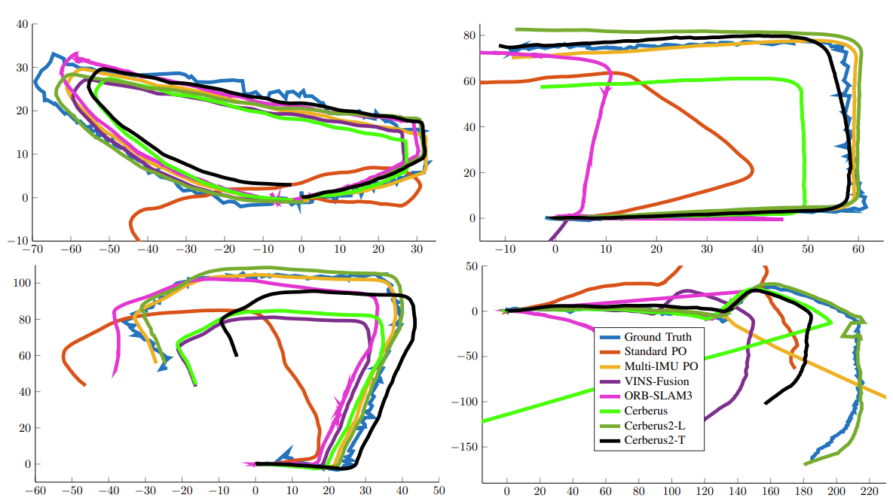

# Cerberus 2.0
A precise low-drift Visual-Inertial-Leg Odometry for legged robots

This is an improved version of [Cerberus](https://github.com/ShuoYangRobotics/Cerberus). It is based on the following publications:

* **Multi-IMU Proprioceptive Odometry for Legged Robots**, Yang, Shuo and Zhang, Zixin and Bokser, Benjamin,  and Manchester, Zachary. (IROS 2023, Best Paper Finalist), [pdf](https://roboticexplorationlab.org/papers/foot_imu_iros2023.pdf)

* **Cerberus: Low-Drift Visual-Inertial-Leg Odometry For Agile Locomotion**, Yang, Shuo and Zhang, Zixin and Fu, Zhengyu and Manchester, Zachary. (ICRA 2023), [pdf](https://ieeexplore.ieee.org/document/10160486)

* **Online Kinematic Calibration for Legged Robots**, Yang, Shuo and Choset, Howie and Manchester, Zachary, IEEE Robotics and Automation Letters (& IROS 2022), [pdf](https://ieeexplore.ieee.org/abstract/document/9807408)


If you use Cerberus or Cerberus2.0 for your academic research, please cite at least one of our related papers.


# Installation
The code is tested on Windows 11 with WSL2 and Ubuntu 20.04.2 LTS. It should also work on Ubuntu 18.04.5 LTS because the code is based on docker. Your computer should install docker (Linux) or Docker Desktop+WSL2 (windows). 

Open the repo folder in VSCode, use VSCode's "remote container" feature to open the repo in a docker container. The docker container will automatically install all the dependencies. The configuration file is in the folder ".devcontainer". Depends on your host computer type, copy either ".devcontainer/devcontainer-ubuntu.json" or ".devcontainer/devcontainer-wsl.json" to ".devcontainer/devcontainer.json", which is the configuration file for VSCode's "remote container" feature.

The docker config file automatically mount the project folder to ~/estimate_ws/src/cerberus2 inside the docker container. After the docker container is built, run "catkin build" to compile cerberus2.0.

# Dataset
Dataset is available on [Google Drive](https://drive.google.com/drive/folders/1Jz3hRNc_yewCvL_H8dJJ5vGTxAGHD31e?usp=sharing)

## Indoor
Each indoor data sequence is a ROS bag file with the following topics:
```
/WT901_47_Data                           : sensor_msgs/Imu          
/WT901_48_Data                           : sensor_msgs/Imu          
/WT901_49_Data                           : sensor_msgs/Imu          
/WT901_50_Data                           : sensor_msgs/Imu          
/camera_forward/infra1/image_rect_raw    : sensor_msgs/Image        
/camera_forward/infra2/image_rect_raw    : sensor_msgs/Image        
/natnet_ros/Shuo_Go1/pose                : geometry_msgs/PoseStamped
/unitree_hardware/imu                    : sensor_msgs/Imu          
/unitree_hardware/joint_foot             : sensor_msgs/JointState
```
where topc "`/natnet_ros/Shuo_Go1/pose`" comes from precise motion capture system Optitrack. 

## Outdoor
Each indoor data sequence has one ROS bag file with the following topics:
```
/WT901_47_Data                           : sensor_msgs/Imu          
/WT901_48_Data                           : sensor_msgs/Imu          
/WT901_49_Data                           : sensor_msgs/Imu          
/WT901_50_Data                           : sensor_msgs/Imu          
/camera_forward/infra1/image_rect_raw    : sensor_msgs/Image        
/camera_forward/infra2/image_rect_raw    : sensor_msgs/Image        
/unitree_hardware/imu                    : sensor_msgs/Imu          
/unitree_hardware/joint_foot             : sensor_msgs/JointState
```
and a "`*.mat`" file that contains iPhone GPS/IMU data. Also some data sequences have a "`*.mov`" video file that contains the video recorded by iPhone behind the robot.

Instruction for generating ground truth trajectory from iPhone GPS/IMU data is located in folder "`/script/matlab`" in the `docker_free_desktop` branch.

## Run Results

### Mill19 Trail
[](https://www.youtube.com/watch?v=C83_xMw58rg)

### CMU Garage



### Various
